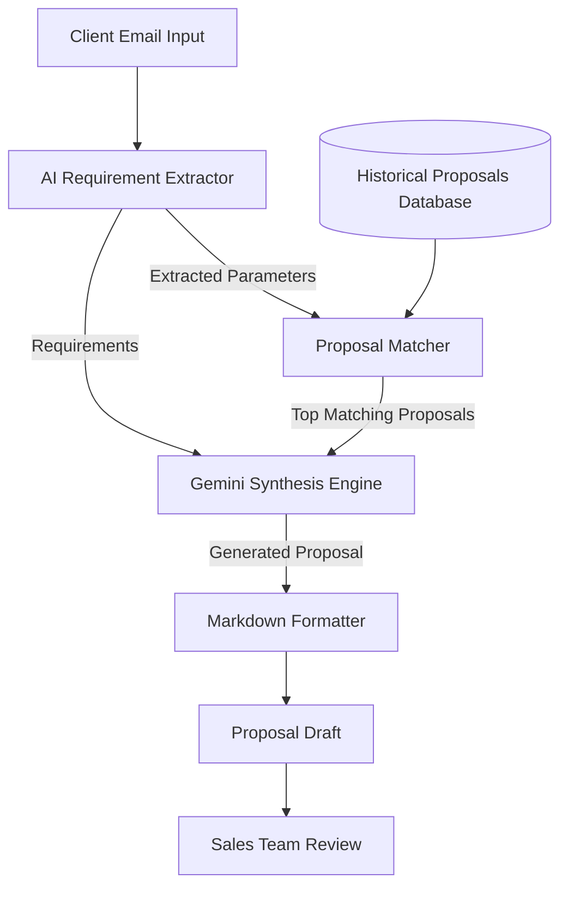

# 🚀 AI-Powered Sales Proposal Generator

An AI-powered solution that automates the creation of professional B2B IT consulting proposals by combining Large Language Models (Gemini) with historical proposal retrieval. The application extracts client requirements from emails, finds similar past projects, and generates customized proposal drafts in Markdown.

## 🌐 Live Demo

**Streamlit App:** 
https://automate-proposal-workflow-znipia3jkxfrdbvekdqgzp.streamlit.app/

---

# 📌 Problem Statement

In B2B IT consulting, sales engineers and account managers spend significant time preparing proposals for potential clients. The traditional process introduces several inefficiencies:

* ⏳ High turnaround time due to manual requirement analysis and proposal drafting.
* 📄 Inconsistent proposal formats and pricing across team members.
* 🧠 Knowledge silos where experienced sales staff know relevant historical projects, while newer employees struggle to locate them.
* ❌ Copy-paste mistakes when modifying previous proposals for new clients.

---

# 💡 Proposed Solution

The AI-Powered Sales Proposal Generator automates the proposal creation workflow using Gemini LLM and historical proposal matching.



---

# ⚙️ Features

* 📧 Extracts structured project requirements from client emails.
* 🔍 Retrieves semantically similar historical proposals.
* 🤖 Generates customized proposals using Google's Gemini 1.5 Flash.
* 📑 Produces professional Markdown proposals ready for review.
* 🎨 Interactive Streamlit interface for easy usage.
* ⚡ Fast proposal generation with minimal manual effort.

---

# 🔄 Workflow

### 1. Client Email Input

The user submits an unstructured client inquiry email.

↓

### 2. Requirement Extraction

Gemini extracts:

* Client Name
* Industry
* Project Requirements
* Technology Preferences
* Timeline
* Estimated Budget

↓

### 3. Historical Proposal Matching

The system searches previous proposals to identify projects with similar:

* Technology Stack
* Industry
* Features
* Project Scope

↓

### 4. Proposal Generation

Gemini combines:

* Extracted requirements
* Historical proposal context
* Standard company proposal structure

to generate a tailored proposal.

↓

### 5. Export

The proposal is generated in Markdown format, making it easy for sales teams to review and customize before sending it to clients.

---

# 🛠 Technology Stack

| Technology           | Purpose                                      |
| -------------------- | -------------------------------------------- |
| Python 3.10+         | Backend Development                          |
| Streamlit            | Web Application                              |
| Gemini 1.5 Flash API | Requirement Extraction & Proposal Generation |
| Rich                 | Enhanced CLI Experience                      |
| python-dotenv        | Environment Variable Management              |
| JSON                 | Historical Proposal Storage                  |

---

# 📁 Project Structure

```text
AI-Proposal-Generator/
│
├── app.py
├── main.py
├── proposal_generator.py
├── parser.py
├── proposal_matcher.py
├── past_proposals.json
├── sample_emails/
├── generated_proposals/
├── requirements.txt
├── .env
└── README.md
```

---

# 📊 End-to-End Pipeline

```
Client Email
      │
      ▼
Requirement Extraction (Gemini)
      │
      ▼
Historical Proposal Matching
      │
      ▼
Proposal Generation (Gemini)
      │
      ▼
Markdown Formatting
      │
      ▼
Generated Proposal
```

---

# 📂 Mock Dataset

## Historical Proposals

The prototype includes sample proposal templates for:

* E-commerce Platform (Next.js + Shopify)
* Mobile Application (React Native)
* CRM Integration (Salesforce + Python)
* Cloud Migration (AWS + DevOps)

Each proposal contains:

* Project Scope
* Deliverables
* Technology Stack
* Timeline
* Team Composition
* Pricing

---

## Sample Client Emails

Three sample inquiry emails are included covering:

* Retail Website Development
* Enterprise CRM Integration
* Mobile Application Development

These emails are used to test the complete workflow.

---

# ▶️ Running the Project

## Clone the Repository

```bash
git clone <repository-url>
cd AI-Proposal-Generator
```

## Install Dependencies

```bash
pip install -r requirements.txt
```

## Configure Environment Variables

Create a `.env` file and add your Gemini API key:

```env
GOOGLE_API_KEY=your_api_key_here
```

## Run the Streamlit App

```bash
streamlit run app.py
```

or run the CLI version:

```bash
python main.py
```

---

# 🎯 Future Enhancements

* PDF and DOCX proposal export
* CRM integration (Salesforce, HubSpot)
* Vector database for semantic search
* Proposal versioning
* Cost estimation engine
* Multi-language proposal generation
* Role-based authentication
* Client feedback integration

---

# 📈 Benefits

* ⏱ Reduces proposal creation time from hours to minutes.
* 📑 Standardizes proposal formatting across teams.
* 🎯 Produces more accurate and personalized proposals.
* 🧠 Reuses organizational knowledge effectively.
* 🚀 Improves sales team productivity and response time.

---

# 👨‍💻 Author

**Karthik M S**

AI & Machine Learning Engineer | Data Science | Generative AI | Python Developer

---

## ⭐ If you found this project useful, consider giving the repository a Star!
