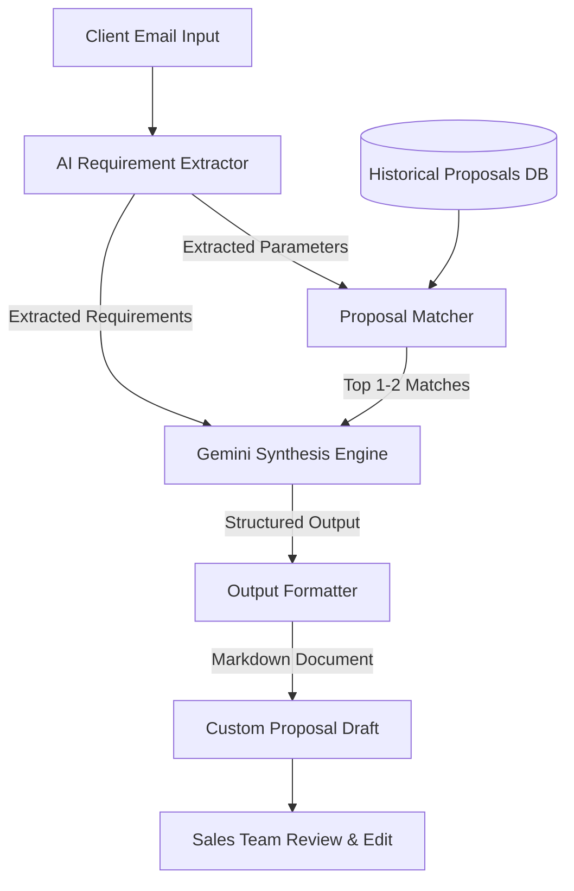

# Solution Design: AI-Powered Sales Proposal Generator
**Industry:** B2B IT Consulting & Custom Software Development Services

---

## 1. Problem Statement & Inefficiencies
In B2B IT consulting, sales engineers and account managers spend a substantial amount of time drafting proposals for client leads. The current process contains several bottlenecks:

*   **High Turnaround Time:** Manually reading requirements from emails, looking through old shared folders/drives for similar deals, and copying/pasting content takes several hours to days per proposal.
*   **Inconsistency in Quality & Layout:** Different team members structure proposals differently. Pricing estimates, team sizes, and service descriptions are not standardized.
*   **Knowledge Silos:** Experienced sales staff know which past projects are similar, but newer reps struggle to find relevant historical work to reference.
*   **Manual Tailoring Errors:** Adapting a previous client's proposal often leads to copy-paste mistakes (such as leaving the previous client's name or tech stack in the new draft).

---

## 2. Proposed Solution
We propose an **AI-Powered Sales Proposal Automation Assistant** that integrates client requirement parsing, historical proposal semantic matching, and custom draft synthesis.



### Key Workflow Steps
1.  **Requirement Extraction:** The system ingests the raw email and passes it to an LLM (Gemini 1.5 Flash). The LLM extracts critical structured parameters: Client Name, Industry, Requirements, Technology Preferences, Expected Budget, and Timeline.
2.  **Semantic Retrieval:** The system scans the database of historical proposals (`past_proposals.json`) and scores them based on overlapping requirements, tech stack, and project type to find the best matching templates.
3.  **Proposal Synthesis:** The system feeds the extracted requirements and the matched historical proposals to Gemini. The LLM acts as an expert sales writer, fusing the standard technical architectures and pricing of past projects with the specific custom constraints of the new client.
4.  **Draft Proposal Generation:** The synthesized proposal is rendered as a clean, structured Markdown file (`.md`) ready for the sales team's review, customization, and final client handoff.

---

## 3. Technology Stack & Selection Rationale

*   **Python 3.10+**: Chosen for its robust ecosystem in data processing and LLM integrations.
*   **Gemini API (`google-generativeai`)**: We leverage the free tier of Gemini (using the `gemini-1.5-flash` model), which provides low-latency, high-quality text understanding and generation with a generous rate limit suitable for prototyping.
*   **Rich Library**: Used for constructing a premium command-line interface. Since this is a python-based prototype run via `main.py`, `rich` provides a beautiful terminal UI (spinners, panels, colored tables) that simulates a SaaS application in the CLI.
*   **python-dotenv**: To load environment variables securely.

---

## 4. End-to-End Workflow Detail

```
+-----------------------------------------------------------------------+
|                             1. INPUT                                  |
| Raw client email received containing unstructured project requirements. |
+------------------------------------+----------------------------------+
                                     |
                                     v
+------------------------------------+----------------------------------+
|                        2. AI PARAMETER PARSER                         |
|  Calls Gemini API to parse:                                           |
|  - Client Name   - Project Goals   - Core Features                    |
|  - Tech Stack    - Timeline        - Estimated Budget                 |
+------------------------------------+----------------------------------+
                                     |
                                     v
+------------------------------------+----------------------------------+
|                        3. HISTORICAL MATCHING                         |
|  Retrieves similar past projects based on tech stack & project scope.  |
|  Provides context (e.g., E-commerce, Mobile App, SaaS) to LLM.       |
+------------------------------------+----------------------------------+
                                     |
                                     v
+------------------------------------+----------------------------------+
|                         4. DRAFT SYNTHESIS                            |
|  LLM combines:                                                       |
|  - Raw Requirements                                                   |
|  - Historical Scope & Architecture                                    |
|  - Standard corporate pricing structures                              |
|  to draft a custom, tailored proposal document.                       |
+------------------------------------+----------------------------------+
                                     |
                                     v
+------------------------------------+----------------------------------+
|                        5. RENDER & EXPORT                             |
|  Formats generated content:                                          |
|  - markdown: For easy editing.                                       |
+-----------------------------------------------------------------------+
```

---

## 5. Mock Data Assumptions
Since this is a working prototype, we define standard mock data for testing:
*   **Past Proposals:** 4 comprehensive project definitions covering E-commerce (Shopify/Next.js), Mobile App (React Native), CRM Integration (Salesforce/Python), and Cloud Migration (AWS/DevOps). Each contains pre-defined scopes, deliverables, timelines, resource roles, and cost metrics.
*   **Client Emails:** 3 sample inquiry emails ranging from a small local retailer asking for a web platform to an enterprise asking for CRM synchronization.
